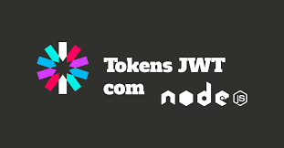

# Prática para aula sobre JWT - backend para autenticação e autorização.

> Trilha FullStack - Rocketseat :rocket:.

## :trophy: Neste projeto aprendi

- typescript
- JWT
- express
- rotas
- node

## :hammer_and_wrench: Tecnologias

- typescript
- Javascript
- Git e Github;

## :mailbox_closed: Contatos

> Email - rosendc30@gmail.com

> Linkedin - https://www.linkedin.com/in/francisco-rosendo-a05623241
